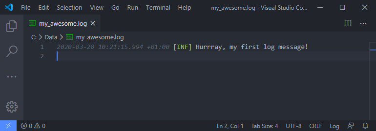

# PoShLog

[](https://github.com/PoShLog/PoShLog)

[](https://www.powershellgallery.com/packages/PoShLog/) [](https://www.powershellgallery.com/packages/PoShLog/) [](https://www.powershellgallery.com/packages/PoShLog/) [](https://discord.gg/FVdVxuw)

>Serilog for powershell

PoShLog is powershell cross-platform logging module. PoShLog allows you to log structured event data into **console**, **file** and much more [places](https://github.com/PoShLog/PoShLog/wiki/Sinks) easily.
It's built upon great C# logging library [Serilog](https://serilog.net/).

## Getting started

If you are familiar with PowerShell, skip to [Installation](#installation) section. For more detailed installation instructions check out [Getting started](https://github.com/PoShLog/PoShLog/wiki/Getting-started) wiki.

### Installation

To install PoShLog, run following snippet from powershell:

```ps1
Install-Module -Name PoShLog
```

## Usage

### Short version

Minimum setup to log into console and file:

```ps1
Import-Module PoShLog

# Create and start new logger
Start-Logger -FilePath 'C:\Data\my_awesome.log' -Console

Write-InfoLog 'Hurrray, my first log message!'

# Don't forget to close the logger
Close-Logger
```


*Image 1: Windows Terminal*



*Image 2: `C:\Data\my_awesome.log` in VS Code*

### Full version

Setup using pipeline fluent API:

```ps1
Import-Module PoShLog

# Create new logger
New-Logger |
    Set-MinimumLevel -Value Verbose |
    Add-SinkPowerShell |
    Add-SinkFile -Path 'C:\Data\my_awesome.log' |
    Start-Logger

# Test all log levels
Write-VerboseLog 'Test verbose message'
Write-DebugLog 'Test debug message'
Write-InfoLog 'Test info message'
Write-WarningLog 'Test warning message'
Write-ErrorLog 'Test error message'
Write-FatalLog 'Test fatal message'

# Example of formatted output
$position = @{
    Latitude = 25
    Longitude = 134
}
$elapsedMs = 34

Write-InfoLog 'Processed {@Position} in {Elapsed:000} ms.' -PropertyValues $position, $elapsedMs

Close-Logger
```

### Extendability

PoShLog is extensible just like Serilog. All available extensions can be found [here](https://github.com/PoShLog/PoShLog/wiki/Extension-modules).

### Documentation

These examples are just to get you started fast. For more detailed documentation please check [wiki](https://github.com/PoShLog/PoShLog/wiki).

## Contributing

Pull requests are welcome. For major changes, please open an issue first to discuss what you would like to change.

### Show your support

* :star: [Star the PoShLog repository](https://github.com/PoShLog/PoShLog)
* :thumbsup: Give me some feedback on [discord](https://discord.gg/FVdVxuw)
* Test PoShLog and raise [issues](https://github.com/PoShLog/PoShLog/issues)
* Contribute :rocket:

### Contributors

* [gitbute](https://github.com/gitbute)

## Authors

* [**Tomáš Bouda**](http://tomasbouda.cz/)

## License

This project is licensed under the MIT License - see the [LICENSE](LICENSE) file for details.

## Credits

* Serilog - [serilog.net](https://serilog.net/)
* Icon made by [Smashicons](https://smashicons.com/) from [www.flaticon.com](https://www.flaticon.com/).
