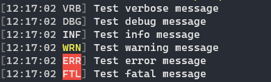
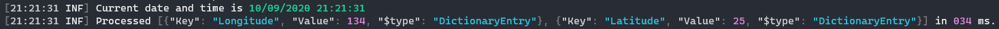
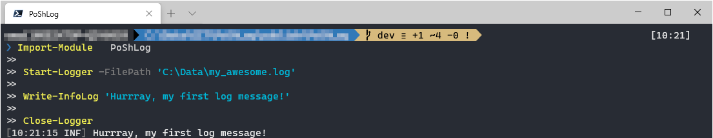

[](https://github.com/PoShLog/PoShLog)

# PoShLog

[](https://www.powershellgallery.com/packages/PoShLog/) [](https://www.powershellgallery.com/packages/PoShLog/) [](https://discord.gg/FVdVxuw) [](https://tomlabscloud.visualstudio.com/PoShLog/_build?definitionId=15) [](https://www.paypal.com/cgi-bin/webscr?cmd=_s-xclick&hosted_button_id=GRARVRTVNEUHS)

>Serilog for powershell

PoShLog is powershell cross-platform logging module. PoShLog allows you to log structured event data into **console**, **file** and much more [places](https://github.com/PoShLog/PoShLog/wiki/Sinks) easily.
It's built upon great C# logging library [Serilog](https://serilog.net/).

## Key Features

* [x] Structured log event data
* [x] Clean and easy to use [API](https://github.com/PoShLog/PoShLog/wiki/Cmdlets)
* [x] Cross-platform
* [x] Easily extensible

## Getting started

If you are familiar with PowerShell, skip to [Installation](#installation) section. For more detailed installation instructions check out [Getting started](https://github.com/PoShLog/PoShLog/wiki/Getting-started) wiki.

### Installation

To install PoShLog, run following snippet from powershell:

```ps1
Install-Module PoShLog
```

## Usage

Setup logger using pipeline fluent API and write some log messages(*in this case into file and console*):

```ps1
Import-Module PoShLog

# Create new logger
# This is where you customize where, when and how to log
New-Logger |
    Set-MinimumLevel -Value Verbose | # You can change this value later to filter log messages
    # Here you can add as many sinks as you want - see https://github.com/PoShLog/PoShLog/wiki/Sinks for all available sinks
    Add-SinkConsole |   # Tell logger to write log messages to console
    Add-SinkFile -Path 'C:\Data\my_awesome.log' | # Tell logger to write log messages into file
    Start-Logger

# Test all log levels
Write-VerboseLog 'Test verbose message'
Write-DebugLog 'Test debug message'
Write-InfoLog 'Test info message'
Write-WarningLog 'Test warning message'
Write-ErrorLog 'Test error message'
Write-FatalLog 'Test fatal message'

Close-Logger
```



[*For detailed documentation see wiki*](https://github.com/PoShLog/PoShLog/wiki)
You can(*and you should*) log formatted data:

```ps1
Write-InfoLog 'Current date and time is {DateTime}' -PropertyValues (Get-Date)

# Some example data
$position = @{
    Latitude = 25
    Longitude = 134
}
$elapsedMs = 34

Write-InfoLog 'Processed {@Position} in {Elapsed:000} ms.' -PropertyValues $position, $elapsedMs
```



Fluent API is too bulky? You don't need extra sinks? Use short setup version(*logs into console and [file](poshlog_example_simplest_file.png)*):

```ps1
# Create and start new logger
Start-Logger -FilePath 'C:\Data\my_awesome.log' -Console

Write-InfoLog 'Hurrray, my first log message!'

# Don't forget to close the logger
Close-Logger
```



### Extendability

PoShLog is extensible just like Serilog. All available extensions can be found [here](https://github.com/PoShLog/PoShLog/wiki/Extension-modules).

### Documentation

These examples are just to get you started fast. For more detailed documentation please check [wiki](https://github.com/PoShLog/PoShLog/wiki).

## Contributing

Pull requests are welcome. For major changes, please open an issue first to discuss what you would like to change.

### Show your support

* :star: Star the PoShLog repository. This is the least you can do to support this project.
* :thumbsup: Give us some feedback or suggest features on [discord](https://discord.gg/FVdVxuw)
* :mag_right: Test PoShLog and raise [issues](https://github.com/PoShLog/PoShLog/issues)
* Contribute :rocket: you can start with [good first issues](https://github.com/PoShLog/PoShLog/issues?q=is%3Aissue+is%3Aopen+label%3A%22good+first+issue%22)

### Contributors

* [Michael Zimmerli](https://github.com/gitbute)

## Authors

* [**Tomáš Bouda**](http://tomasbouda.cz)

## Release Notes

* [v2.1.1](releaseNotes/v2.1.1.md)
* [v2.1.0](releaseNotes/v2.1.0.md)

## License

This project is licensed under the MIT License - see the [LICENSE](LICENSE) file for details.

## Credits

* Serilog - [serilog.net](https://serilog.net/)
* Icon made by [Smashicons](https://smashicons.com/) from [www.flaticon.com](https://www.flaticon.com/).
